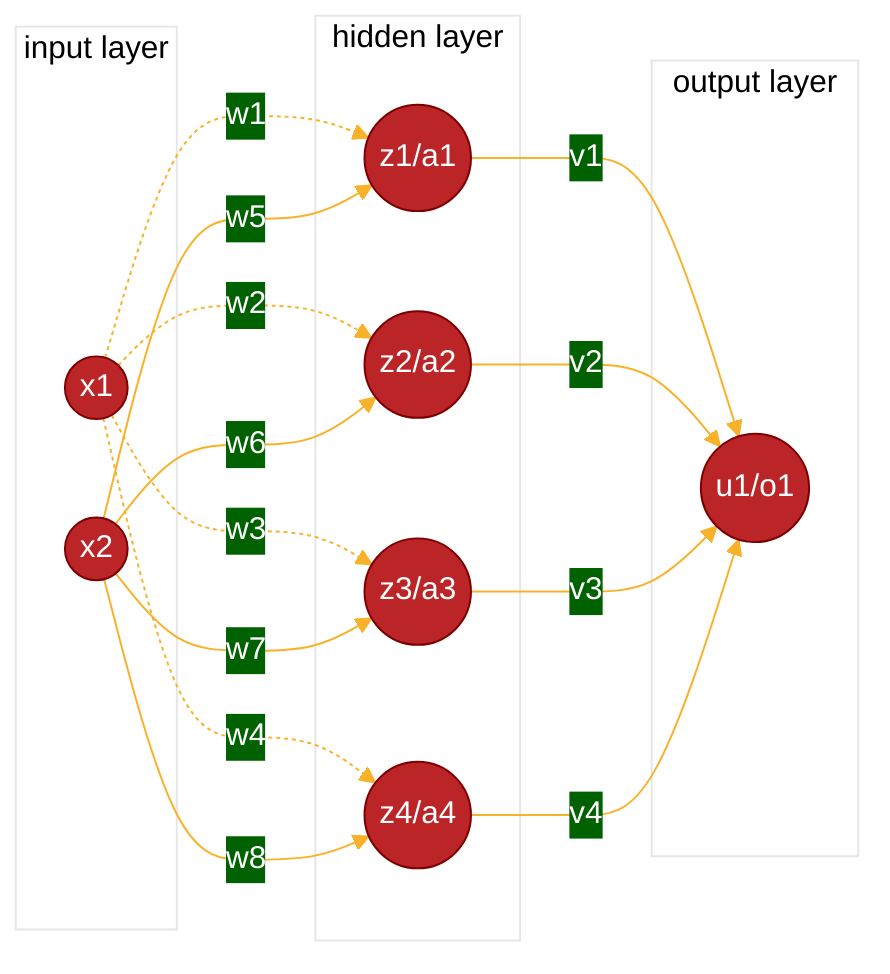

# Derivative

$$
\begin{align}
&\lim_{h \rightarrow 0} \frac{f(x+h)-f(x)}{h} \tag{1}\\
\end{align}
$$
## Derivative of integral

![[Math Definitions-1.png]]

# Integral

![[Math Definitions-2.png]]

# Numbers
$\mathbb{R}$ = Real numbers includes all real number [-inf, inf]
$\mathbb{Q}$ = Rational numbers ( numbers written as ratio)
$\mathbb{N}$ = Natural numbers (all positive integers starting from 1. (1,2,3....inf)
$\mathbb{Z}$ = Integers ( all integers positive and negative ( -inf, ..., -2,-1,0,1,2....inf)

# GCD & LCM
$\operatorname{lcm}(a,b)	=	\text{least common multiple of integers a and b}$  
$\operatorname{gcd}(a,b)	=	\text{greatest common divisor of integers a and b}$  

$$
\begin{align}
	\operatorname{lcm}(a,b)=\frac{|a \cdot b|}{\operatorname{gcd}(a,b)} \tag{2}\\
\end{align}
$$
# Neural Network Representation

